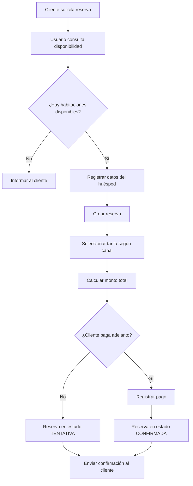
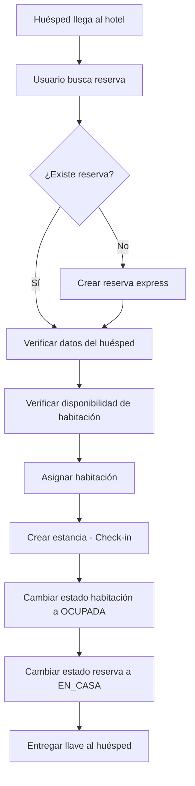
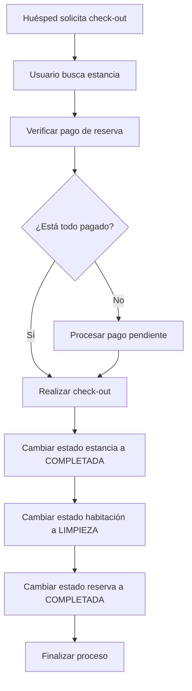
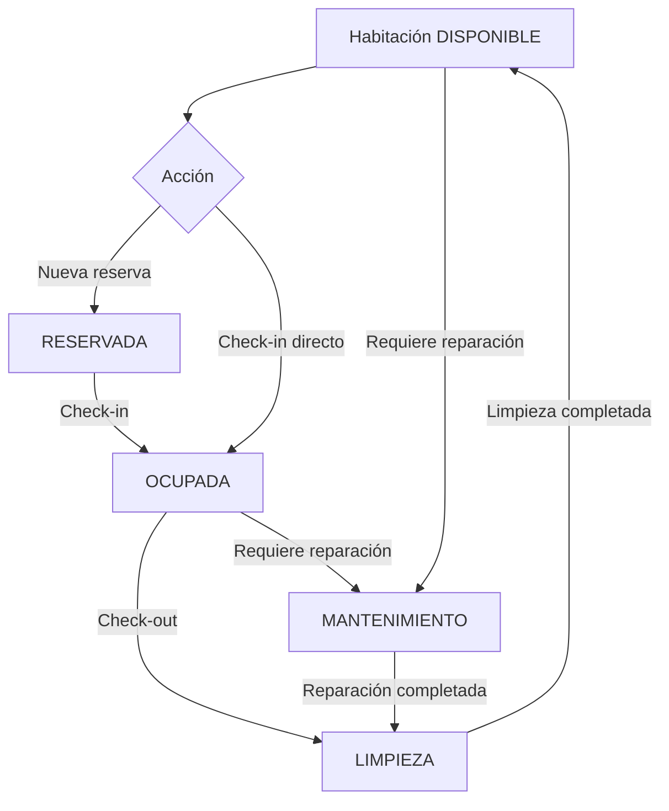
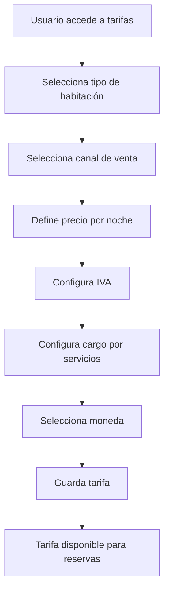
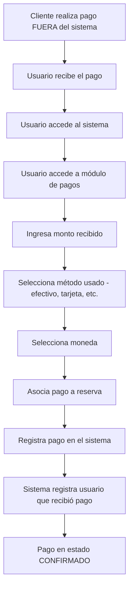

# Sistema de Gestión Hotelera para el Hotel KORIKALLPA - Documentación General Version 1.0.0

## Índice

1. [Introducción](#introducción)
2. [Alcance del Sistema](#alcance-del-sistema)
3. [Tecnologías Utilizadas](#tecnologías-utilizadas)
4. [Módulos del Sistema](#módulos-del-sistema)
5. [Requerimientos Funcionales](#requerimientos-funcionales)
6. [Requerimientos No Funcionales](#requerimientos-no-funcionales)
7. [Control de Acceso](#control-de-acceso)
8. [Flujos de Trabajo](#flujos-de-trabajo)

---

## Introducción

El Sistema de Gestión Hotelera es una aplicación web diseñada para administrar las operaciones diarias del hotel, desde la gestión de reservas hasta el control de inventario de muebles y el registro de pagos.

### Objetivo

Proporcionar una herramienta integral que permita al personal del hotel gestionar eficientemente:

- Reservas de habitaciones
- Check-in y check-out de huéspedes
- Control de habitaciones y su estado
- Registro de pagos
- Inventario básico de muebles
- Tarifas por canal de venta

---

## Alcance del Sistema

### ¿Qué INCLUYE el sistema?

El sistema cubre las siguientes funcionalidades:

✅ **Gestión de Reservas**

- Crear, modificar y cancelar reservas
- Consultar disponibilidad de habitaciones
- Gestionar información de huéspedes
- Registro de pagos de reservas

✅ **Gestión de Estancias (Check-in/Check-out)**

- Registro de entrada de huéspedes
- Registro de salida de huéspedes
- Control de habitaciones ocupadas

✅ **Gestión de Habitaciones**

- Catálogo de habitaciones físicas
- Estados operacionales (disponible, ocupada, limpieza, mantenimiento)
- Tipos de habitación
- Control de última limpieza

✅ **Gestión de Huéspedes**

- Registro de datos personales
- Historial de reservas y estancias
- Información de contacto

✅ **Gestión de Tarifas**

- Precios por tipo de habitación
- Precios por canal de venta
- Configuración de IVA y cargos por servicio

✅ **Gestión de Canales de Venta**

- Canales OTA (Booking, Expedia, etc.)
- Reservas directas
- Agentes de viaje

✅ **Gestión de Pagos**

- Registro manual de pagos recibidos
- Indicación del método de pago utilizado (efectivo, tarjetas, transferencias)
- Estados de pago
- **Nota**: No incluye integración con pasarelas de pago. El usuario registra manualmente los pagos que recibe.

✅ **Inventario Básico de Muebles**

- Catálogo de muebles
- Categorías de muebles
- Asignación de muebles a habitaciones
- Control de condición de muebles

✅ **Autenticación**

- Sistema de usuarios con Better Auth
- Gestión de sesiones
- Control de acceso

### ¿Qué NO INCLUYE el sistema?

El sistema tiene las siguientes limitaciones:

❌ **Aplicación móvil** (Android / iOS)

- No hay aplicaciones nativas para dispositivos móviles
- El sistema es web responsive pero no tiene apps dedicadas

❌ **Integración directa con plataformas OTA**

- No se sincroniza automáticamente con Booking, Airbnb, etc.
- Las reservas de OTA deben ingresarse manualmente

❌ **Módulo de restaurante/cocina/bar**

- No incluye gestión de consumos durante la estancia
- No incluye gestión de comandas, cocina o bar
- No hay registro de servicios adicionales o cargos al folio

❌ **Facturación electrónica completa con SUNAT**

- No genera comprobantes electrónicos
- No se integra con SUNAT para envío automático

❌ **Sistema contable completo**

- No incluye libro mayor, balance general, etc.
- Solo registro de pagos básicos

❌ **Integraciones con sistemas externos**

- No se integra con ERP o CRM
- No hay conexión con sistemas de terceros

❌ **Procesamiento de pagos**

- No se integra con pasarelas de pago (Stripe, PayPal, Mercado Pago, etc.)
- No procesa pagos con tarjetas directamente
- El sistema solo REGISTRA que se recibió un pago
- El cobro real se hace fuera del sistema (terminal POS, transferencia bancaria, efectivo)

❌ **Automatización avanzada**

- No incluye inteligencia artificial
- No hay predicciones automáticas
- No hay análisis predictivo

---

## Tecnologías Utilizadas

### Backend

- **Runtime**: Bun (JavaScript runtime moderno y rápido)
- **Framework**: Hono v4 (Framework web ligero y rápido)
- **Base de datos**: PostgreSQL (Base de datos relacional)
- **ORM**: Prisma (Object-Relational Mapping)
- **Autenticación**: Better Auth (Sistema de autenticación moderno)
- **Validación**: Zod v4 (Validación de esquemas TypeScript)

### Frontend

- **Framework**: React (Biblioteca para interfaces de usuario)

### Infraestructura

- **Contenedores**: Docker (Para despliegue y desarrollo)
- **Control de versiones**: Git

---

## Módulos del Sistema

El sistema está organizado en los siguientes módulos funcionales:

### 1. Módulo de Huéspedes

Gestiona la información de los clientes del hotel.

**Funcionalidades:**

- Registrar nuevos huéspedes
- Actualizar información de contacto
- Consultar historial de estancias
- Buscar huéspedes por email o documento

### 2. Módulo de Habitaciones

Administra las habitaciones físicas del hotel.

**Funcionalidades:**

- Crear y configurar habitaciones
- Definir tipos de habitación
- Actualizar estado operacional
- Registrar fecha de última limpieza
- Asignar muebles a habitaciones

### 3. Módulo de Reservas

Gestiona las reservas de habitaciones.

**Funcionalidades:**

- Crear nuevas reservas
- Modificar reservas existentes
- Cancelar reservas
- Consultar disponibilidad
- Asociar pagos a reservas

### 4. Módulo de Estancias

Controla el check-in y check-out de huéspedes.

**Funcionalidades:**

- Realizar check-in
- Realizar check-out
- Consultar huéspedes en casa
- Registrar fechas de entrada y salida

### 5. Módulo de Tarifas

Administra los precios de las habitaciones.

**Funcionalidades:**

- Configurar precios por tipo de habitación
- Configurar precios por canal de venta
- Definir IVA y cargos por servicio
- Gestionar monedas

### 6. Módulo de Canales

Gestiona los canales de venta.

**Funcionalidades:**

- Registrar canales OTA
- Configurar canales directos
- Activar/desactivar canales
- Asociar tarifas a canales

### 7. Módulo de Pagos

Registra manualmente los pagos recibidos en el hotel.

**Funcionalidades:**

- Registrar manualmente pagos de reservas
- Indicar el método de pago utilizado (efectivo, VISA, Mastercard, etc.)
- Consultar historial de pagos registrados
- Asociar pagos a reservas

**Importante**: Este módulo NO procesa pagos ni se integra con pasarelas de pago. Solo permite registrar que se recibió un pago y por qué medio se realizó. El procesamiento real del pago (cobro con tarjeta, transferencia bancaria, etc.) se hace fuera del sistema.

### 8. Módulo de Inventario

Control básico de muebles.

**Funcionalidades:**

- Catálogo de muebles
- Categorías de muebles
- Asignación a habitaciones
- Control de condición

### 9. Módulo de Autenticación

Gestiona el acceso al sistema.

**Funcionalidades:**

- Registro de usuarios
- Autenticación con Better Auth
- Gestión de sesiones
- Control de acceso

---

## Requerimientos Funcionales

### RF-01: Gestión de Huéspedes

**Descripción**: El sistema debe permitir registrar y gestionar la información de los huéspedes.

**Criterios de aceptación**:

- El sistema debe permitir crear un nuevo huésped con: nombres, apellidos, email, teléfono, nacionalidad, tipo y número de documento
- El email debe ser único en el sistema
- El sistema debe permitir actualizar la información de un huésped
- El sistema debe permitir consultar el historial de un huésped
- El sistema debe permitir eliminar un huésped (si no tiene reservas activas)

### RF-02: Gestión de Habitaciones

**Descripción**: El sistema debe permitir administrar las habitaciones físicas del hotel.

**Criterios de aceptación**:

- El sistema debe permitir crear habitaciones con: número, tipo, piso, características (ducha/baño)
- El número de habitación debe ser único
- El sistema debe permitir actualizar el estado de una habitación (disponible, ocupada, limpieza, mantenimiento, reservada)
- El sistema debe registrar la fecha de última limpieza
- El sistema debe permitir asignar múltiples imágenes a una habitación

### RF-03: Gestión de Tipos de Habitación

**Descripción**: El sistema debe permitir definir categorías de habitaciones.

**Criterios de aceptación**:

- El sistema debe permitir crear tipos de habitación con nombre y descripción
- El nombre del tipo debe ser único
- El sistema debe permitir actualizar y eliminar tipos (si no tienen habitaciones asociadas)

### RF-04: Consulta de Disponibilidad

**Descripción**: El sistema debe mostrar las habitaciones disponibles para un rango de fechas.

**Criterios de aceptación**:

- El sistema debe permitir consultar disponibilidad por fechas de entrada y salida
- El sistema debe excluir habitaciones reservadas u ocupadas en ese rango
- El sistema debe mostrar solo habitaciones en estado "DISPONIBLE"

### RF-05: Gestión de Reservas

**Descripción**: El sistema debe permitir crear y gestionar reservas de habitaciones.

**Criterios de aceptación**:

- El sistema debe permitir crear una reserva con: huésped, habitación, fechas, número de adultos y niños
- El sistema debe calcular automáticamente el monto total basado en la tarifa y número de noches
- El sistema debe permitir aplicar descuentos
- El sistema debe permitir cancelar una reserva con motivo
- El sistema debe mantener un historial inmutable de reservas completadas
- El sistema debe generar un código único para cada reserva

### RF-06: Check-in y Check-out

**Descripción**: El sistema debe permitir registrar la entrada y salida de huéspedes.

**Criterios de aceptación**:

- El sistema debe permitir realizar check-in asociado a una reserva
- El sistema debe registrar la fecha y hora de entrada
- El sistema debe permitir realizar check-out registrando la fecha y hora de salida
- El sistema debe cambiar el estado de la estancia a "COMPLETADA" al hacer checkout
- Las estancias completadas no deben poder modificarse

### RF-07: Gestión de Tarifas

**Descripción**: El sistema debe permitir configurar precios por tipo de habitación y canal.

**Criterios de aceptación**:

- El sistema debe permitir crear tarifas asociando tipo de habitación y canal
- El sistema debe permitir configurar precio por noche, IVA y cargo por servicios
- El sistema debe soportar múltiples monedas
- El sistema debe permitir actualizar tarifas existentes

### RF-08: Gestión de Canales de Venta

**Descripción**: El sistema debe permitir administrar los canales de venta.

**Criterios de aceptación**:

- El sistema debe permitir crear canales con nombre y tipo (OTA, Directo, Agente)
- El sistema debe permitir activar/desactivar canales
- El nombre del canal debe ser único
- El sistema debe permitir eliminar canales (si no tienen tarifas asociadas)

### RF-09: Registro de Pagos

**Descripción**: El sistema debe permitir registrar manualmente los pagos recibidos de reservas.

**Criterios de aceptación**:

- El sistema debe permitir registrar pagos con: monto, método utilizado, fecha
- El sistema debe permitir indicar el método de pago (efectivo, VISA, Mastercard, AMEX, transferencia)
- El sistema debe permitir asociar pagos a reservas
- El sistema debe registrar qué usuario registró el pago
- El sistema debe permitir cambiar el estado del pago (confirmado, devuelto, anulado)

**Nota importante**: El sistema NO procesa pagos ni se integra con pasarelas de pago. Solo registra que se recibió un pago y por qué medio. El cobro real se realiza fuera del sistema (terminal de punto de venta, transferencia bancaria, efectivo, etc.).

### RF-10: Inventario de Muebles

**Descripción**: El sistema debe permitir gestionar el inventario básico de muebles.

**Criterios de aceptación**:

- El sistema debe permitir crear muebles con: código, nombre, categoría, condición
- El código del mueble debe ser único
- El sistema debe permitir asignar muebles a habitaciones
- El sistema debe permitir registrar la condición del mueble (bueno, regular, dañado, faltante)
- El sistema debe permitir registrar fecha de adquisición y última revisión

### RF-11: Autenticación

**Descripción**: El sistema debe controlar el acceso mediante autenticación de usuarios.

**Criterios de aceptación**:

- El sistema debe requerir autenticación para todas las operaciones
- El sistema debe usar Better Auth para gestionar usuarios y sesiones
- El sistema debe mantener sesiones de usuario activas
- El sistema debe permitir cerrar sesión
- Todos los usuarios autenticados tienen acceso completo al sistema

---

## Requerimientos No Funcionales

### RNF-01: Rendimiento

- El sistema debe responder a las consultas en menos de 2 segundos
- El sistema debe soportar al menos 50 usuarios concurrentes
- Las operaciones de base de datos deben estar optimizadas con índices

### RNF-02: Seguridad

- Todas las contraseñas deben estar encriptadas
- El sistema debe usar HTTPS para todas las comunicaciones
- El sistema debe validar todos los datos de entrada
- El sistema debe proteger contra inyección SQL
- El sistema debe implementar autenticación obligatoria

### RNF-03: Usabilidad

- La interfaz debe ser intuitiva y fácil de usar
- El sistema debe ser responsive (adaptarse a diferentes tamaños de pantalla)
- Los mensajes de error deben ser claros y descriptivos
- El sistema debe proporcionar retroalimentación visual de las operaciones

### RNF-04: Disponibilidad

- El sistema debe estar disponible 24/7
- El tiempo de inactividad planificado no debe exceder 4 horas al mes
- El sistema debe tener respaldos automáticos diarios

### RNF-05: Mantenibilidad

- El código debe seguir estándares de clean code
- El sistema debe estar documentado
- El código debe tener cobertura de pruebas
- El sistema debe usar arquitectura en capas

### RNF-06: Escalabilidad

- El sistema debe poder crecer para soportar más habitaciones
- La base de datos debe poder escalar horizontalmente
- El sistema debe poder agregar nuevos módulos sin afectar los existentes

### RNF-07: Compatibilidad

- El sistema debe funcionar en navegadores modernos (Chrome, Firefox, Safari, Edge)
- El sistema debe ser compatible con PostgreSQL 12 o superior
- El sistema debe funcionar en contenedores Docker

### RNF-08: Integridad de Datos

- El sistema debe mantener la integridad referencial en la base de datos
- Las transacciones deben ser atómicas
- Los datos históricos no deben poder modificarse (reservas completadas, estancias finalizadas)

---

## Control de Acceso

El sistema requiere autenticación para todas las operaciones. Todos los usuarios autenticados tienen acceso completo a las funcionalidades del sistema.

### Usuario Autenticado

**Descripción**: Cualquier usuario con credenciales válidas en el sistema.

**Permisos**:

- ✅ Gestionar huéspedes (crear, consultar, modificar, eliminar)
- ✅ Gestionar habitaciones (crear, consultar, modificar, eliminar)
- ✅ Gestionar tipos de habitación (crear, consultar, modificar, eliminar)
- ✅ Gestionar reservas (crear, consultar, modificar, cancelar, eliminar)
- ✅ Realizar check-in y check-out
- ✅ Gestionar tarifas (crear, consultar, modificar, eliminar)
- ✅ Gestionar canales (crear, consultar, modificar, eliminar)
- ✅ Registrar y gestionar pagos
- ✅ Gestionar inventario de muebles

**Nota**: El sistema de roles y permisos diferenciados está en desarrollo y se implementará en futuras versiones.

---

## Flujos de Trabajo

A continuación se describen los flujos de trabajo principales del sistema.

### Flujo 1: Proceso de Reserva

### Flujo 2: Proceso de Check-in

### Flujo 3: Proceso de Check-out

### Flujo 4: Gestión de Estado de Habitaciones

### Flujo 5: Configuración de Tarifas

### Flujo 6: Registro de Pago

**Nota importante**: El sistema NO procesa el pago. El cobro real (con terminal POS, efectivo, transferencia) se realiza fuera del sistema. El usuario solo registra en el sistema que recibió un pago y por qué medio.

---

## Documentación Relacionada

Este documento es parte de un conjunto completo de documentación del sistema. Para información más detallada, consulte:

### Documentación para Usuarios

- **[Casos de Uso](./CASOS_USO.md)**: Descripción detallada de los casos de uso principales del sistema con flujos paso a paso.

- **[Flujos de Trabajo Detallados](./FLUJOS_TRABAJO.md)**: Diagramas y descripciones de los flujos operativos completos, desde la reserva hasta el check-out, gestión diaria de habitaciones, configuración inicial y más.

- **[Glosario de Términos](./GLOSARIO.md)**: Definiciones de todos los términos técnicos y de negocio utilizados en el sistema.

- **[Preguntas Frecuentes y Mejores Prácticas](./FAQ_Y_MEJORES_PRACTICAS.md)**: Respuestas a preguntas comunes, mejores prácticas operativas, solución de problemas y consejos de seguridad.

### Documentación Técnica de API

Para desarrolladores e integradores, consulte la documentación técnica de cada endpoint:

- [API de Canales](../api-documentation/CANAL_API_DOC.md)
- [API de Estancias](../api-documentation/ESTANCIA_API_DOC.md)
- [API de Habitaciones](../api-documentation/HABITACION_API_DOC.md)
- [API de Disponibilidad de Habitaciones](../api-documentation/HABITACION_DISPONIBLES_API_DOC.md)
- [API de Huéspedes](../api-documentation/HUESPED_API_DOC.md)
- [API de Muebles](../api-documentation/MUEBLE_API_DOC.md)
- [API de Pagos](../api-documentation/PAGO_API_DOC.md)
- [API de Reservas](../api-documentation/RESERVA_API_DOC.md)
- [API de Tarifas](../api-documentation/TARIFA_API_DOC.md)
- [API de Tipos de Habitación](../api-documentation/TIPO_HABITACION_API_DOC.md)

### Documentación Técnica del Proyecto

- **[AGENTS.md](../../AGENTS.md)**: Guía de referencia para desarrolladores que trabajan en el backend del sistema.

- **[README.md](../../README.md)**: Instrucciones de instalación y ejecución del proyecto.

---

## Resumen Ejecutivo

El Sistema de Gestión Hotelera es una solución completa para hoteles pequeños y medianos que buscan digitalizar sus operaciones. El sistema cubre desde la gestión de reservas hasta el control de inventario, pasando por check-in/check-out, pagos y tarifas.

**Beneficios principales**:

- ✅ Centralización de información en un solo sistema
- ✅ Reducción de errores manuales
- ✅ Mejora en la eficiencia operativa
- ✅ Control en tiempo real del estado de habitaciones
- ✅ Historial completo de huéspedes y reservas
- ✅ Gestión de múltiples canales de venta
- ✅ Control básico de inventario

**Limitaciones conocidas**:

- ❌ No incluye aplicación móvil nativa
- ❌ No se integra automáticamente con OTAs
- ❌ No incluye módulo de restaurante/bar/consumos
- ❌ No genera facturación electrónica completa
- ❌ No incluye sistema contable completo

**Funcionalidades en desarrollo**:

- Sistema de roles y permisos diferenciados (ADMIN, PERSONAL)
- Gestión de consumos y servicios durante la estancia
- Folios de cargos

Para comenzar a usar el sistema, consulte la [Guía de Configuración Inicial](./FLUJOS_TRABAJO.md#flujo-configuración-inicial-del-sistema) y las [Mejores Prácticas Operativas](./FAQ_Y_MEJORES_PRACTICAS.md#mejores-prácticas-operativas).
