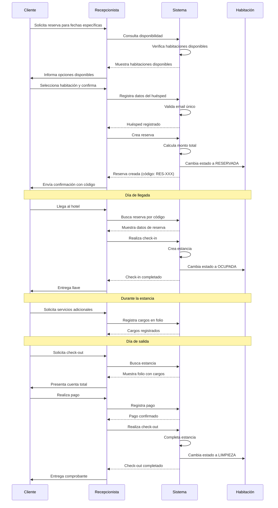
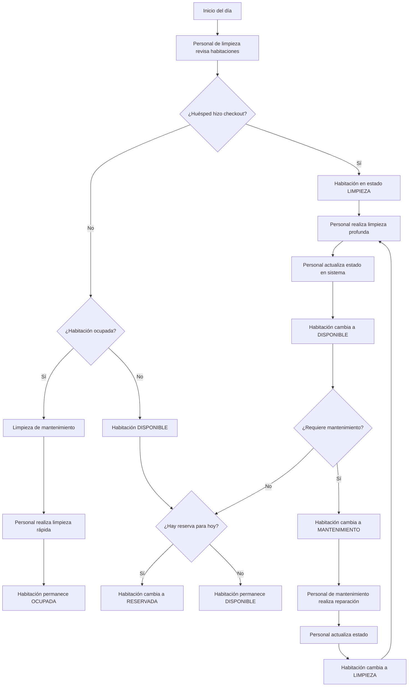
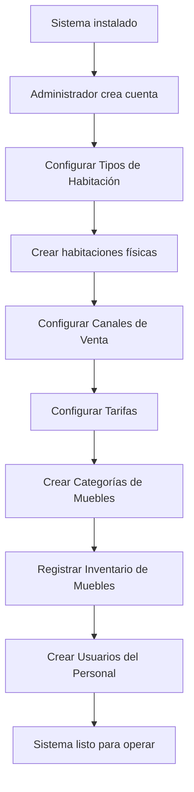
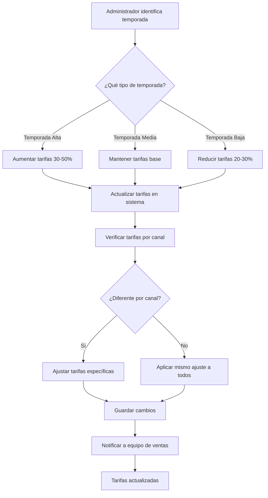
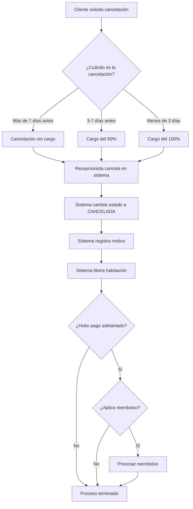
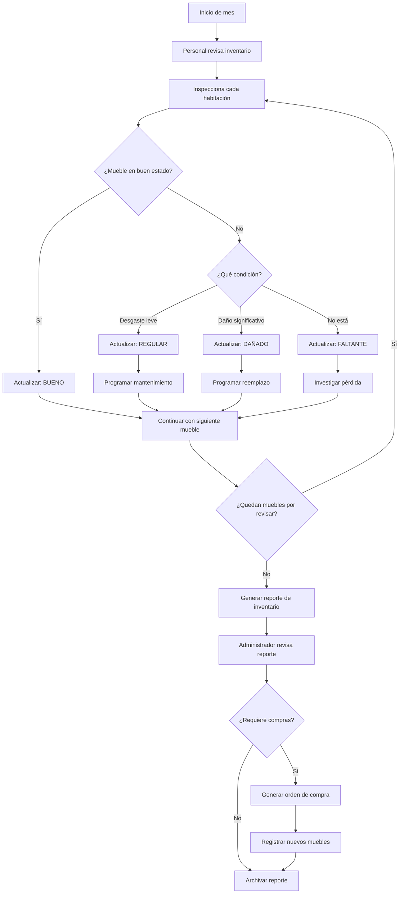

# Flujos de Trabajo Detallados

Este documento describe los flujos de trabajo operativos del Sistema de Gestión Hotelera con mayor detalle.

---

## Índice

1. [Flujo Completo: De la Reserva al Check-out](#flujo-completo-de-la-reserva-al-check-out)
2. [Flujo: Gestión Diaria de Habitaciones](#flujo-gestión-diaria-de-habitaciones)
3. [Flujo: Configuración Inicial del Sistema](#flujo-configuración-inicial-del-sistema)
4. [Flujo: Gestión de Tarifas por Temporada](#flujo-gestión-de-tarifas-por-temporada)
5. [Flujo: Manejo de Cancelaciones](#flujo-manejo-de-cancelaciones)
6. [Flujo: Control de Inventario](#flujo-control-de-inventario)

---

## Flujo Completo: De la Reserva al Check-out

Este es el flujo completo desde que un cliente solicita una reserva hasta que realiza el check-out.

### Descripción Paso a Paso

**Fase 1: Reserva (Días/Semanas antes)**

1. Cliente contacta al hotel (teléfono, email, presencial, OTA)
2. Recepcionista consulta disponibilidad en el sistema
3. Sistema muestra habitaciones disponibles con sus tarifas
4. Cliente selecciona habitación y confirma fechas
5. Recepcionista registra o busca datos del huésped
6. Sistema crea la reserva con estado TENTATIVA
7. Si hay pago adelantado, se registra y la reserva pasa a CONFIRMADA
8. Sistema genera código único de reserva
9. Cliente recibe confirmación

**Fase 2: Check-in (Día de llegada)**

1. Huésped llega al hotel
2. Recepcionista busca la reserva en el sistema
3. Verifica identidad del huésped
4. Confirma habitación asignada
5. Sistema crea la estancia
6. Habitación cambia a estado OCUPADA
7. Reserva cambia a estado EN_CASA
8. Recepcionista entrega llave

**Fase 3: Durante la Estancia**

1. Huésped consume servicios del hotel
2. Personal registra cargos en el folio
3. Sistema acumula el total de consumos
4. Huésped puede solicitar cambios o servicios adicionales

**Fase 4: Check-out (Día de salida)**

1. Huésped solicita check-out
2. Recepcionista consulta el folio
3. Sistema muestra todos los cargos pendientes
4. Recepcionista presenta cuenta total al huésped
5. Huésped realiza el pago
6. Sistema registra el pago
7. Recepcionista realiza check-out en el sistema
8. Estancia cambia a COMPLETADA (inmutable)
9. Reserva cambia a COMPLETADA (inmutable)
10. Habitación cambia a LIMPIEZA
11. Sistema genera comprobante
12. Recepcionista entrega comprobante al huésped

---

## Flujo: Gestión Diaria de Habitaciones

Este flujo describe cómo el personal gestiona el estado de las habitaciones durante el día.

### Roles Involucrados

**Personal de Limpieza**:

- Revisa habitaciones después del checkout
- Realiza limpieza profunda
- Actualiza estado a DISPONIBLE cuando termina
- Reporta necesidades de mantenimiento

**Personal de Mantenimiento**:

- Atiende habitaciones en estado MANTENIMIENTO
- Realiza reparaciones necesarias
- Actualiza estado cuando termina

**Recepcionista**:

- Monitorea disponibilidad en tiempo real
- Asigna habitaciones a nuevas reservas
- Coordina con limpieza y mantenimiento

---

## Flujo: Configuración Inicial del Sistema

Este flujo describe los pasos para configurar el sistema cuando se implementa por primera vez.

### Pasos Detallados

**1. Crear Cuenta de Administrador**

- Registrar primer usuario con rol ADMIN
- Configurar email y contraseña
- Verificar acceso al sistema

**2. Configurar Tipos de Habitación**

- Crear categorías: Suite, Deluxe, Estándar, Económica, etc.
- Definir descripción de cada tipo
- Ejemplo:
  - Suite Deluxe: "Suite de lujo con vista al mar"
  - Habitación Estándar: "Habitación cómoda con comodidades básicas"

**3. Crear Habitaciones Físicas**

- Registrar cada habitación del hotel
- Asignar número único (101, 102, 201, etc.)
- Asociar a un tipo de habitación
- Definir piso
- Indicar si tiene ducha y/o baño
- Subir imágenes
- Estado inicial: DISPONIBLE

**4. Configurar Canales de Venta**

- Crear canal "Directo" (tipo: DIRECTO)
- Crear canales OTA: Booking.com, Expedia, Airbnb (tipo: OTA)
- Crear canales de agentes si aplica (tipo: AGENTE)
- Marcar todos como activos

**5. Configurar Tarifas**

- Para cada tipo de habitación, crear tarifas por canal
- Ejemplo:
  - Suite Deluxe + Booking.com = $150/noche
  - Suite Deluxe + Directo = $130/noche
  - Habitación Estándar + Booking.com = $80/noche
- Configurar IVA (18% en Perú)
- Configurar cargo por servicios si aplica

**6. Crear Categorías de Muebles**

- Crear categorías: Cama, Mueble, Electrónico, Baño, Decoración
- Definir descripción de cada categoría

**7. Registrar Inventario**

- Registrar cada mueble con código único
- Asignar a categoría
- Asignar a habitación
- Definir condición inicial: BUENO
- Registrar fecha de adquisición

**8. Crear Usuarios del Personal**

- Registrar recepcionistas con rol PERSONAL
- Registrar personal de limpieza con rol PERSONAL
- Registrar gerentes con rol ADMIN
- Configurar emails y contraseñas

---

## Flujo: Gestión de Tarifas por Temporada

Este flujo describe cómo ajustar tarifas según la temporada.

### Ejemplo Práctico

**Temporada Baja (Enero-Marzo)**:

- Suite Deluxe: $100/noche (reducción de $150)
- Habitación Estándar: $60/noche (reducción de $80)

**Temporada Media (Abril-Junio, Septiembre-Noviembre)**:

- Suite Deluxe: $150/noche (tarifa base)
- Habitación Estándar: $80/noche (tarifa base)

**Temporada Alta (Julio-Agosto, Diciembre)**:

- Suite Deluxe: $200/noche (aumento de $150)
- Habitación Estándar: $110/noche (aumento de $80)

---

## Flujo: Manejo de Cancelaciones

Este flujo describe cómo manejar diferentes tipos de cancelaciones.

### Políticas de Cancelación

**Flexible** (Más de 7 días antes):

- Reembolso del 100%
- Sin cargos adicionales
- Habitación liberada inmediatamente

**Moderada** (3-7 días antes):

- Reembolso del 50%
- Cargo del 50% del total
- Habitación liberada

**Estricta** (Menos de 3 días):

- Sin reembolso
- Cargo del 100% del total
- Habitación liberada

**No Show** (Cliente no llega):

- Sin reembolso
- Cargo del 100% del total
- Estado cambia a NO_LLEGO

---

## Flujo: Control de Inventario

Este flujo describe cómo mantener el control del inventario de muebles.

### Frecuencia de Revisión

**Revisión Mensual**:

- Inspección completa de todas las habitaciones
- Actualización de condición de muebles
- Generación de reporte

**Revisión Semanal**:

- Inspección rápida de habitaciones de alta rotación
- Identificación de daños urgentes

**Revisión Diaria**:

- Personal de limpieza reporta daños evidentes
- Actualización inmediata en sistema

### Acciones según Condición

**BUENO**:

- No requiere acción
- Continuar con mantenimiento preventivo

**REGULAR**:

- Programar mantenimiento
- Monitorear en próxima revisión

**DAÑADO**:

- Programar reemplazo urgente
- Evaluar si la habitación puede seguir operando

**FALTANTE**:

- Investigar causa de pérdida
- Reemplazar inmediatamente
- Actualizar inventario
